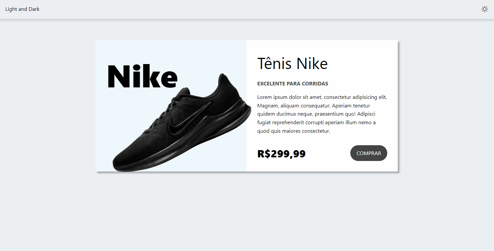

<div align="center">
  <h1>Switch Theme</h1>
  <p>Landing page responsiva de um tênis, com a opção de troca dos claro e escuro, utilizando JavaScript.</p>
  
</div>

# 📒 Índice
* [Descrição](#descrição)
* [Requisitos Funcionais](#requisitos)
* [Tecnologias](#tecnologias)
* [Design](#design)
  * [Cores](#cores)
  * [Fontes](#fontes)
  * [Ícones](#ícones)
* [Instalação](#instalação)
* [Licença](#licença)

# 📃 <span id="descrição">Descrição</span>
Landing page responsiva de um tênis, com a opção de troca dos claro e escuro, utilizando JavaScript e utilizando o pacote ícones [**Bootstrap Icons**](https://icons.getbootstrap.com/).

# 📌 <span id="requisitos">Requisitos Funcionais</span>
- [x] Troca de tema, claro e escuro<br>
- [x] Responsividade<br>

# 💻 <span id="tecnologias">Tecnologias</span>
- **HTML**
- **CSS**
- **JavaScript**

# 🎨 <span id="design">Design</span>
- O modelo final para versão desktop e mobile está disponível na pasta `./design`

- <span id="cores">Cores<br></span>
  * #eceff1<br>
  * #fff<br>
  * #eff7fc<br>
  * #444<br>
  * #263238<br>
  * #37474f<br>
  * #273035<br>
  * #67b4f3<br>
  * #2196f3<br>

- <span id="fontes">Fontes<br></span>
  * Arial, sans-serif

- <span id="ícones">Ícones<br></span>
  * Bootstrap Icons

# 🚀 <span id="instalação">Instalação</span>
```bash
  # Clone este repositório:
  $ git clone https://github.com/CleilsonAndrade/switch_theme.git
  $ cd ./switch_theme
```

# 📝 <span id="licença">Licença</span>
Esse projeto está sob a licença MIT. Veja o arquivo [LICENSE](LICENSE) para mais detalhes.

---

<p align="center">
  Feito com 💜 by CleilsonAndrade
</p>